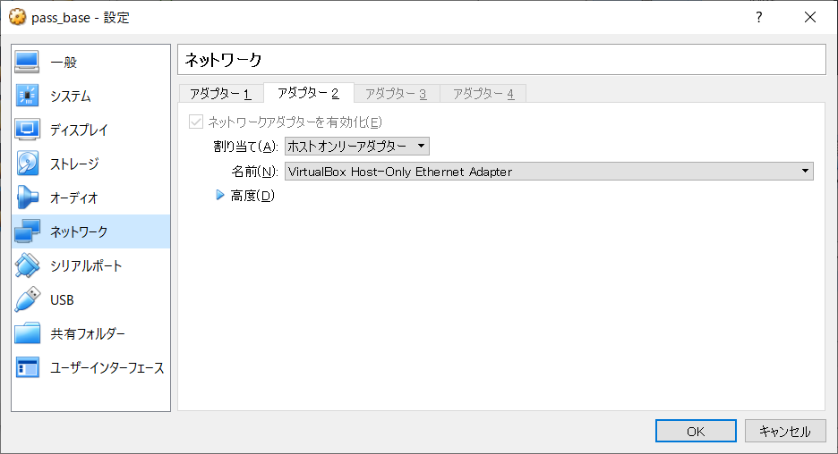
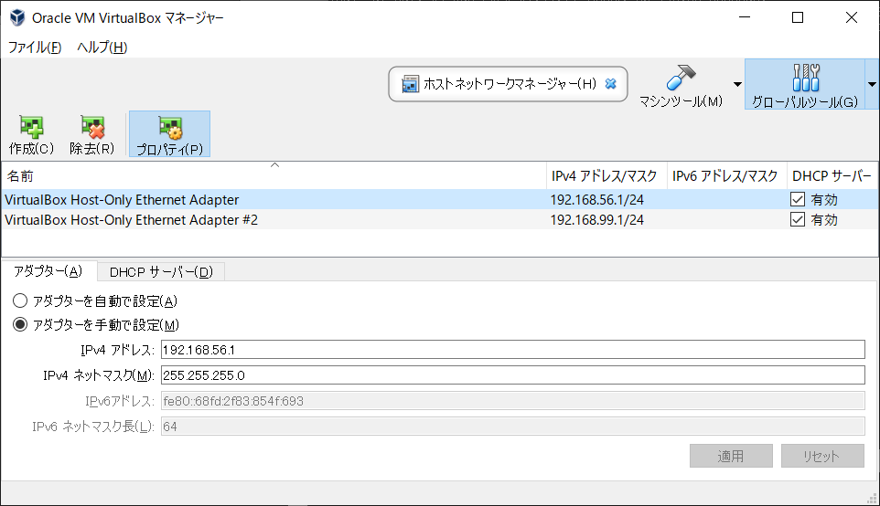
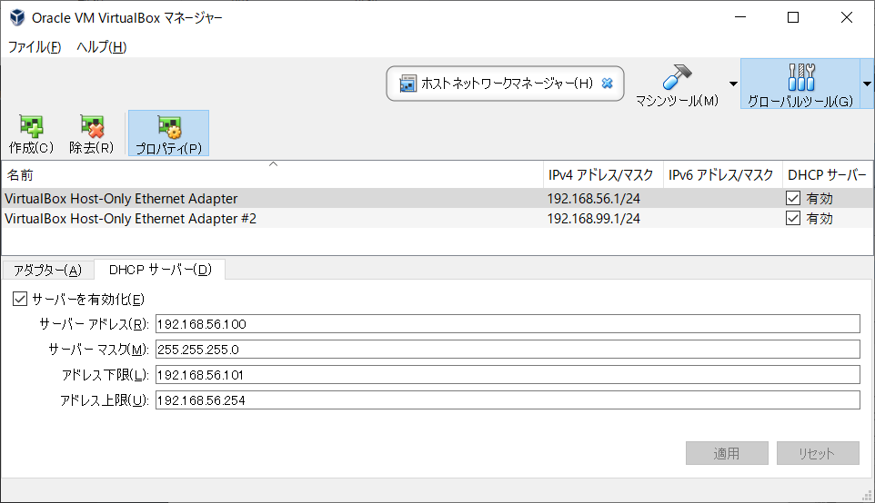

### 虚拟机网络模式详解

```
### Vmware虚拟机三种网络模式详解
https://blog.csdn.net/Noob_f/article/details/51099040

### VirtualBox虚拟机几种网络连接方式介绍
https://blog.csdn.net/bifengmiaozhuan/article/details/79887692
```


### VitrualBox上安装Ubuntu18.04

####  准备
  [下载VitrualBox](https://www.virtualbox.org/)    [下载Ubuntu Server](https://ubuntu.com/download)

#### 难点1：网络设定

  VitrualBox虚拟机创建之后，network adapter1 -> nat, network adpter2 -> host only adapter 

参考




#### 设定固定IP

```yaml
su -
cd /etc/netplan
vi 50_cloud_init.yaml

network:
    ethernets:
        enp0s3:
            dhcp4: true
        enp0s8:
            addresses: [192.168.56.108/24]
            gateway4: 192.168.56.2
            nameservers:
                addresses: [192.168.56.2]
            # optional: true
    version: 2

netplan apply
ip a
```

#### 设定hostname
```
vi /etc/cloud/cloud.cfg
preserve_hostname: true

cat /etc/hostname
sudo hostnamectl set-hostname foobar

cat /etc/hosts
sudo reboot now
```

#### 设定root密码，允许root远程登陆
  ```
sudo su -
passwd

vi /etc/ssh/sshd_config
    PermitRootLogin yes
  
service ssh restart
  ```

#### 时区，语言
  ```shell
chronyc sources
sudo timedatectl set-timezone Asia/Tokyo
localectl set-locale LANG=zh_cn.UTF-8

# centos7
yum search chrony
sudo yum install chrony.x86_64
sudo systemctl start chronyd
systemctl status chronyd
timedatectl
  ```

#### apt更新
  ```
sudo apt update
sudo apt upgrade
sudo apt clean && apt autoclean
sudo apt autoremove
  ```


```
ip route show

https://ytooyama.hatenadiary.jp/entry/2018/07/20/002249

% sudo vi /etc/netplan/50-cloud-init.yaml 
# Let NetworkManager manage all devices on this system
network:
  version: 2
  renderer: NetworkManager
(以上の三行だけ書く)

% sudo apt install network-manager && sudo reboot
(Network Managerを入れて再起動する)

% sudo nmtui
(IPアドレスの設定をCLIとかTUIツールとかで実施)

---------------------------------------
systemd-resolve --status
https://qiita.com/atomyah/items/1989138730f3385844dd
---------------------------------

netstat -tlnp|grep **
https://www.cnblogs.com/boright88/p/3170171.html
-------------------------------------

wget http://ftp.tsukuba.wide.ad.jp/software/apache/tomcat/tomcat-8/v8.5.50/bin/apache-tomcat-8.5.50.zip

https://linuxize.com/post/how-to-install-tomcat-8-5-on-ubuntu-18.04/
------------------------------------
```

#### help

- [Virtual Boxのスナップショット作成でゲストOSが起動しなくなった話](https://qiita.com/kyamawaki/items/aba69a38164f6544960d)
- [Virtualbox: VM does not start after creating a snapshot](https://michlstechblog.info/blog/virtualbox-no-boot-after-snapshot-efail-0x80004005/)

```shell
# parent
"C:\euler\Oracle\VirtualBox\vboxmanage.exe" internalcommands dumphdinfo "D:\15.VM\200104.ubuntu1804.server.base\200104.ubuntu1804.server.base.vhd"

# child
"C:\euler\Oracle\VirtualBox\vboxmanage.exe" internalcommands dumphdinfo "C:\Users\lcs43\VirtualBox VMs\ubuntu1804.server\200104.ubuntu1804.server.base\Snapshots\{e198f888-e490-4301-a128-564f870fee5e}.vhd"

# set parent
"C:\euler\Oracle\VirtualBox\vboxmanage.exe" internalcommands sethdparentuuid "C:\Users\lcs43\VirtualBox VMs\ubuntu1804.server\200104.ubuntu1804.server.base\Snapshots\{e198f888-e490-4301-a128-564f870fee5e}.vhd" {b3982993-5bc4-4304-a28b-619ad7c7aa3c}
```

check sum

```
D:\11.Program\61.memo\200104.Linux\iso>CertUtil -hashfile CentOS-8.1.1911-x86_64-dvd1_ali.iso SHA256
SHA256 ハッシュ (対象 CentOS-8.1.1911-x86_64-dvd1_ali.iso):
3ee3f4ea1538e026fff763e2b284a6f20b259d91d1ad5688f5783a67d279423b
CertUtil: -hashfile コマンドは正常に完了しました。

https://wiki.centos.org/Manuals/ReleaseNotes/CentOS8.1911?action=show&redirect=Manuals%2FReleaseNotes%2FCentOSLinux8

# CentOS-8.1.1911-x86_64-dvd1.iso: 7554990080 bytes
SHA256 (CentOS-8.1.1911-x86_64-dvd1.iso) = 3ee3f4ea1538e026fff763e2b284a6f20b259d91d1ad5688f5783a67d279423b
```


### useful commands

```

```

